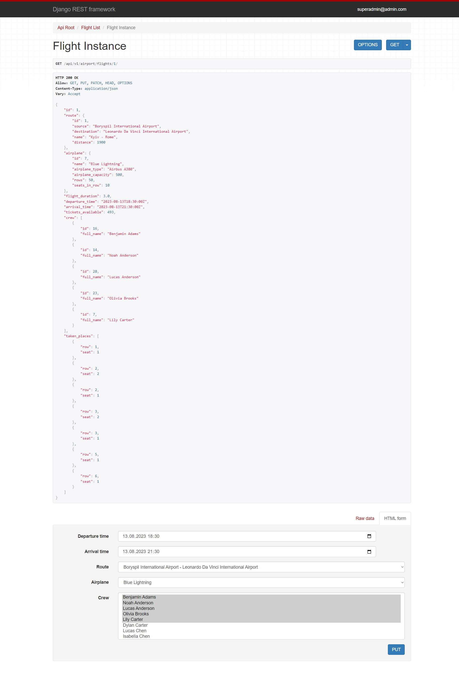
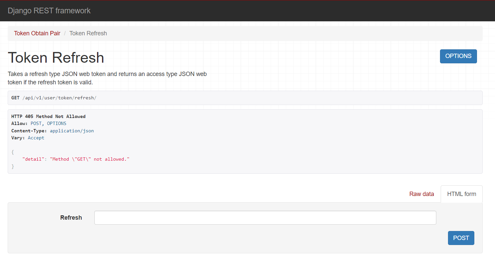

<div align="center">

# Airport API Service
 

</div>

<br>

<hr>

## Table of Contents

- [About Project](#about-project)
- [Application functional](#functional)
- [Technologies](#technologies)
- [Prerequisites](#prerequisites)
- [Setup](#setup)
- [Accessing the Application](#accessing-the-application)
- [Shutdown](#shutdown)
- [Demo](#demo)


<hr>

## About Project

Flight tracking is an indispensable aspect of modern aviation and has become a necessity for various reasons. 
<br>
In today's interconnected world, the ability to monitor and trace the movement of aircraft in real-time 
offers several benefits that contribute to safety and efficiency of air travel.

The Airport API Service helps to track flights from airports across the whole globe.

<br>
The main functions of project:

- Track and save flights from airports;
- Order flight tickets;
- Store order information for customers.

<hr>

## Functional

#### Staff required:

1. Add countries to the service from list of all countries
2. Add only existing cities to countries (check with WeatherAPI)
3. Add airports with airport type
4. Create and manage routes
5. Add crew members and change some information about them
6. Create, manage and track flights

#### Authenticated user required:

1. See the list of countries, cities and detailed information pages
2. Observe airports and airport types
3. Check out routs
4. See crew list and details pages
5. Track and choose a flight
6. Order flight tickets
7. Check your order information

#### Non-authenticated user required:
1. Create an account using only email address and password
2. Log in with a JSON web token

<b>Please note</b>: 
Any service information can only be deleted from the admin page


<hr>

## Technologies

- [Django Official Documentation](https://docs.djangoproject.com/)
<br>Django is a high-level Python Web framework. In this project, it's used to create the backend service. This service builds the Django application and exposes it on port 8080.


- [Postgres Official Documentation](https://www.postgresql.org/docs/)
<br>Postgres is a powerful, open-source object-relational database system. In this project, it is used as the main data store. This service runs the latest version of Postgres, exposed on port 5432. It uses a volume to persist the database data.
<hr>


## Prerequisites

1. Make sure you have Docker and Docker Compose installed on your system. 
You can check the installation instructions [here for Docker](https://docs.docker.com/get-docker/) 
and [here for Docker Compose](https://docs.docker.com/compose/install/).

<hr>

## Setup

<b>There are two ways to setup the project</b>:
- Pulling from Docker Hub;
- Cloning from Git.

### Docker Hub

1. Pull the project with the command:
```
docker pull diashiro/airport-api-service:airport-api-service
```
2. Run the Docker containers:
```
docker-compose up
```

### Git Hub

1. Clone the project:
```
git clone https://github.com/diana-shyrokikh/airport-api-service.git
```
2. Navigate to the project directory:
```
cd airport-api-service
```
3. Build and run the Docker containers:
```
docker-compose up -d --build
```

<hr>

## Accessing the Application

### Documentation is accessible at:
1. `http://localhost:8000/api/v1/doc/swagger/`
2. `http://localhost:8000/api/v1/doc/redoc/`

### API
1. Airport API Service is accessible at `http://localhost:8000/api/v1/airport/`
2. The detailed Page for a specific resource is available at `http://localhost:8000/api/v1/airport/<resource_name>/id/`
3. Registration Page is accessible at `http://localhost:8000/api/v1/user/register/`
4. Token Obtain Pair Page is accessible at `http://localhost:8000/api/v1/user/token/`
5. Token Refresh Page is accessible at `http://localhost:8000/api/v1/user/token/refresh/`
6. Django Admin Page is accessible at `http://localhost:8000/admin/`

<br>

Use these credentials to log in as a user
<br>(functionality for staff will be open):

    Email address: user@user.com
    Password: user123456

<hr>

## Shutdown

1. To stop running server use CTRL-C

<hr>

## Demo







<hr>

Remember to replace `localhost` with the relevant IP address if you're not accessing these 
from the same machine where the services are running.

<br>
Please make sure to replace placeholders with your actual values in the `.env` file. 
Also, these instructions are subject to changes in the project, 
so always refer to the project's README or other documentation for the most accurate information.

<hr>
